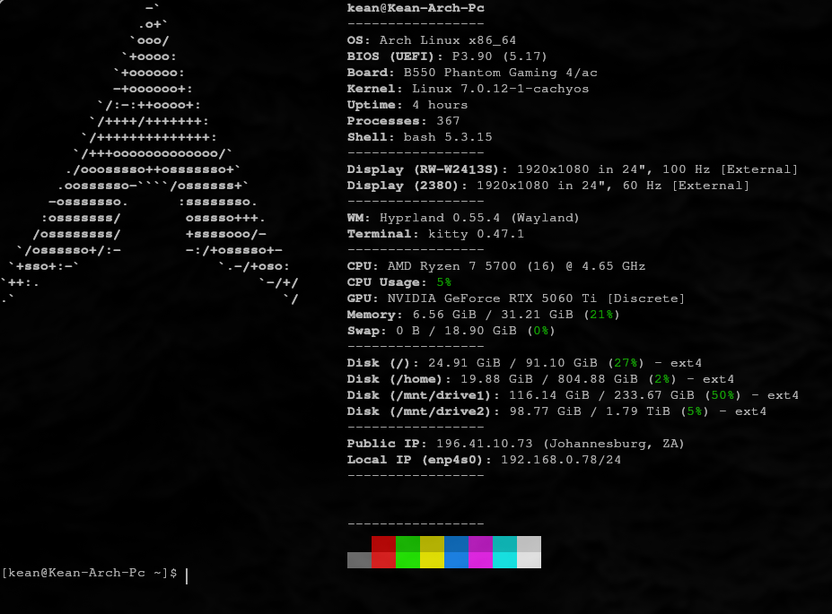
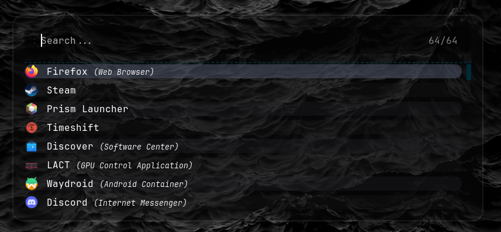
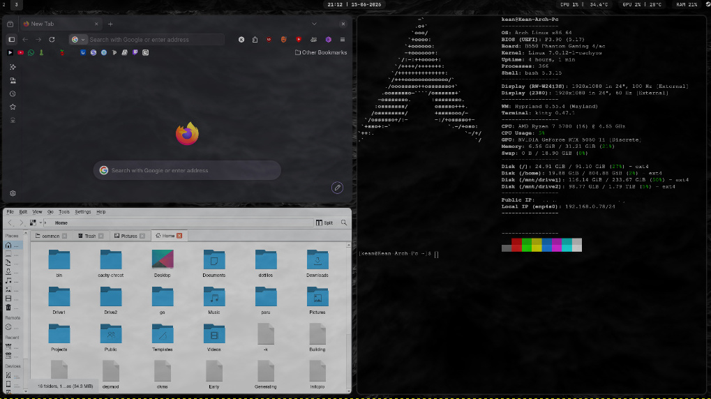

# Screenshots






- **Hyprland**:
- **Waybar**: 
- **Rofi**: 
- **Kitty**: 
- **Fastfetch**: 
- **Shell**: 
- **hyplock**:
- **awww**:
- **wlogout**:


```bash
git clone https://github.com/KeanBP36/KeanBP36-Arch-Hyprland-Config.git ~/dotfiles && cd ~/dotfiles && chmod +x install.sh && ./install.sh
```

If u have configs u want to replace
```bash
rm -rf ~/.config/hypr ~/.config/waybar ~/.config/rofi ~/.config/fastfetch ~/.zshrc ~/.bashrc && \
rm -rf ~/dotfiles && \
git clone https://github.com/KeanBP36/KeanBP36-Arch-Hyprland-Config.git ~/dotfiles && \
cd ~/dotfiles && \
chmod +x install.sh && \
./install.sh
```
to updae your conifg
```bash
git clone https://github.com/KeanBP36/KeanBP36-Arch-Hyprland-Config.git ~/dotfiles
```
